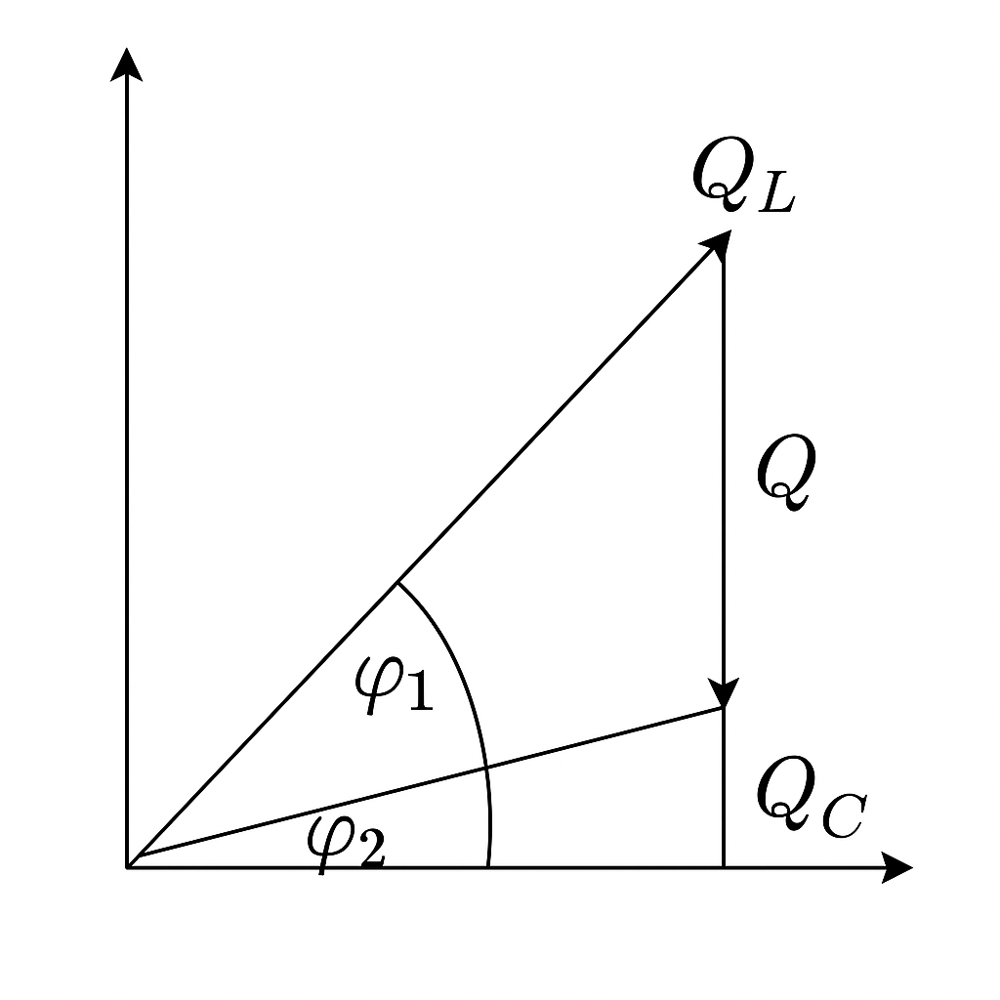

### Aufgabe 1
Ein Wechselstrommotor hat bei 230 V 50 Hz eine Leistungsaufnahme von 1,6 kW. Der Wirkfaktor beträgt  
cos φ₁ = 0,65. Durch Parallelkompensation soll der Wirkfaktor auf cos φ₂ = 0,90 verbessert werden.  
Bestimmen Sie  
a) die erforderliche kapazitive Blindleistung  
b) die Kapazität des Kompensationskondensators.

geg: P=1,6kW
cos $ \Phi_1  = 0,65 (vor Kompensation) $
$\Phi_1 = cos^-1 (0,65)$

$cos \Phi_2 =0,9 (nach Kompensation)$

$ C= \frac{1100 var}{2* \Pi*50Hz*230V^2} $

- a) 
$ Q_c =P* (tan \Phi_1-tan \Phi_2)$
$=1,6kW(tan(cos^-1 (0,65))-tan(cos^-1 /0,9)) =1,1kvar$$

### Aufgabe 2

Ein Wechselstrommotor hat die Bemessungsdaten:  
**U** = 230 V,  
**f** = 50 Hz,  
**P** = 1,8 kW,  
**η** = 0,82 und  
**cos φ₁** = 0,7.  

Durch Parallelkompensation soll der Wirkwirkfaktor auf **cos φ₂** = 0,9 verbessert werden.

**Berechnen Sie die Kapazität C des Kompensationskondensators.**
$n= \frac{P_(ab)} {P_(zu)} $
$ P_(zu) = \frac {P_(ab)}{n}$
$ P_(zu) = \frac {1,8kW}{0,82}$
$ P_(zu) = 2,19kvar $

$ Q_c =P* (tan \Phi_1-tan \Phi_2)$
$Q_c=2,19kW(tan(cos^-1 (0,82))-tan(cos^-1 /0,9)) =1,176kvar$

$ C= \frac{Q_c}{2* \Pi*f*2U^2} $

$ C= \frac{1176 var}{2* \Pi*50Hz*230V^2} $
$C= 70µF$

### Aufgabe 3
$S=U*I$

### Aufgabe 4
Ein Elektromotor wird am 230 V Netz (f = 50 Hz) betrieben. Es wird eine Wirkleistung  
P = 1310 W und ein Strom I = 7,3 A gemessen, wobei der Strom der Spannung nacheilt.

a) Bestimmen Sie die Schein- und die Blindleistung sowie den Leistungsfaktor φ rechnerisch.  
b) Berechnen Sie die Kapazität des Kondensators, um die induktive Blindleistung vollständig zu kompensieren.

- a)
$P=U*I*cos \Phi $
$P=S*cos \Phi $
$cos\phi = \frac{P}{S}=\frac{1310W}{230V*7,3A}=0,78 $
$Q=\sqrt{S²-P²}= \sqrt{(230V*7,5A)-(1310W)²}=1050,2var $

- b)
$Q_L=Q_C $
$C= \frac{Q_C}{2*\Pi*f*U²}=\frac{1050,2var}{2*\pi*50Hz*(230V)²} = 63,18mF$

### Aufgabe 5
Zur Kompensation eines Einphasenmotors wird an 230 V 50 Hz ein Kondensator von 110 µF parallel geschaltet.  
Vor der Kompensation wurde ein Wirkfaktor von 0,75 gemessen, danach 0,92.  
Berechnen Sie die aufgenommene Wirkleistung.

$C= \frac{Q_C}{2*\Pi*f*U²}$
$Q_C=C*2*\Pi*U² $
$Q_C=110µF*2*\Pi*(230V)²*f$
$Q_C=1828,09var$

$cos\Phi_1=0,75$
$cos\Phi_2=0,92$
$ Q_c =P* (tan \Phi_1-tan \Phi_2)$
$P= \frac{Q_C}{(tan \Phi_1-tan \Phi_2)}$
$P= \frac{1828,09var}{(tan(cos^{-1} (0,75))-tan(cos^{-1} (0,92))}$
$P=4009,68W$
