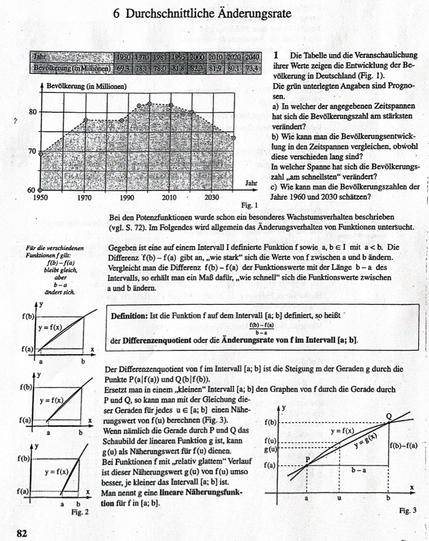

# Differentialrechnung
---
## Ableitungen
### Durchschnittliche Änderungsrate:
## 6 Durchschnittliche Änderungsrate

  
  

  
- a)
  $Änderungsrate: $
  $\frac{f(3)-f(1)}{3-1}=\frac{-1-1}{2}=\frac{-2}{2}=-1 $
  
  $\frac{f(-1)-f(3)}{1-3}=\frac{+1-(-1)}{-2}=\frac{2}{-2}=-1$
---
  ### Aufgabe 1
Gegeben ist die Funktion  
\[
f(x) = x^2
\]

Ziel: Tangente im Punkt P(1/2) (bei x=1)

m=2(gesuchte Tangente)

---

### Berechnen Sie die durchschnittliche Änderungsrate in den Intervallen:

| Intervall       | \([-1; 1]\)  | \([0; 1]\) | \([0{,}5; 1]\) | \([0{,}9; 1]\) | \([0{,}99; 1]\) |
|-----------------|------------|------------|----------------|----------------|-----------------|
| Änderungsrate = Differenzenquotient |$\frac{1-1}{1-(-1)}=0$|$\frac{0-1}{0-1}=1$ |$\frac{0,5²-1²}{0,5-1}=1,5$|$\frac{0,9²-1²}{0,9-1}=1,9$|$\frac{0,99²-1²}{0,99-1}=1,99$|

---

### Allgemeine Formulierung:

**Differenzenquotient** von \( f \) im Intervall  
\[
I = [1 - h; 1]
\]
$P(1-h|(1-h)²)$

$ÄR: \frac{(1-h)²-(-1)²}{(1-h)-1}= \frac{(1-2h+h²)-1}{-h}=\frac{-2h+h²}{-h}=\frac{-h*(2-h)}{-h}=2-h$

---

**Der linksseitige Differentialquotient** an der Stelle  
\[
x_0 = 1
\]
$lim h-->0$
$(2-h)=2$

Die gesuchte **Tangente** hat die Steigung 2.
