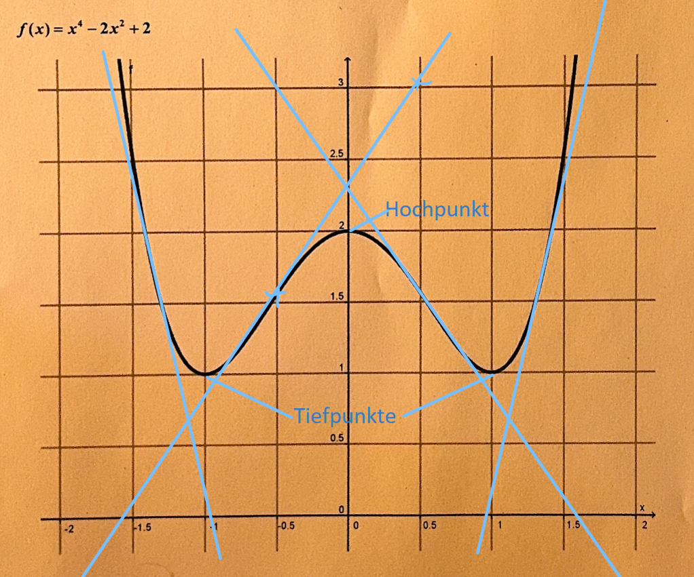

# Ableitung von Funktionen

**Gegeben ist die Funktion:**  
\( f(x) = x^4 - 2x^2 + 2 \)

---

### 1. Vervollständigen Sie die Wertetabelle:

| x     | -1,5 | -1  | -0,5 | 0   | 0,5 | 1   | 1,5 |
|-------|------|-----|------|-----|-----|-----|-----|
| y|2,5|1|1,6|2|1,6|1|2,5|

---

### 2. Zeichnen Sie bei  
\( x = -1{,}5;\ -1;\ -0{,}5;\ 0;\ 0{,}5;\ 1;\ 1{,}5 \)  
die Tangenten an den Graphen an.

---

### 3. Schätzen Sie die Steigungen der gezeichneten Tangenten in den Punkten:

| x                        | -1,5 | -1  | -0,5 | 0   | 0,5 | 1   | 1,5 |
|--------------------------|------|-----|------|-----|-----|-----|-----|
| Steigung der Tangente    |-6|0|1,5|0|-1,5|0|6|

---

### 4. Der Graph der Funktion hat bei  
\( x = 0 \) einen **Hochpunkt**,  
bei \( x = -1 \) und \( x = 1 \) jeweils einen **Tiefpunkt**.  

**Die Steigung der Tangenten in diesen Punkten ist** \_\_\_\_\_\_ .
